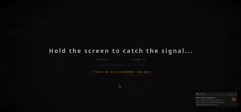

# Knock! — The 1973 Threshold



> *"Knock, knock, knockin' on heaven's door…"*
> A digital art installation where you surrender your burdens to a 1973 FM radio signal — and the signal answers back.

---

## 🎙️ Project Description & Artistic Statement

**The 1973 Threshold** is an immersive, AI-powered web experience built as an interactive digital art installation. Inspired by Bob Dylan's *Knockin' on Heaven's Door* (1973), the project invites users to type out a personal burden — a worry, a regret, a weight they carry — and transmit it into the ether of a vintage radio interface.

The radio receives the burden, understands its emotional tone, and responds with:
- A **poetic farewell text** written in the spirit of a 70s FM radio host
- A **spoken voice narration** in a warm, human voice
- A **1970s Polaroid-style generated image** reflecting the emotional mood
- A **dynamic ambient soundscape** that shifts with the sentiment of the burden

Every transmission is saved to a **Memory Wall** — a visual archive of burdens released, rendered as faded Polaroid photographs on the right panel of the interface.

The aesthetic goal is timelessness: the interface looks and feels like a relic of 1973, but powered entirely by state-of-the-art AI running in the background.

---

## 🏗️ Technical Architecture Overview

The project follows a clean **client-server architecture** with a decoupled Angular frontend and an ASP.NET Core backend acting as an AI orchestration layer.

```
┌─────────────────────────────────────────────────────────────────┐
│                        BROWSER (Angular 19)                     │
│                                                                 │
│  ┌──────────────┐  ┌──────────────────┐  ┌────────────────────┐ │
│  │ BurdenInput  │  │ RadioInterface   │  │ TransmissionDisplay│ │
│  │  Component   │→ │  (Orchestrator)  │→ │    Component       │ │
│  └──────────────┘  └────────┬─────────┘  └────────────────────┘ │
│                             │                                   │
│  ┌──────────────┐  ┌────────▼─────────┐  ┌───────────────────┐  │
│  │ BurdenPrompts│  │   ApiService     │  │   AudioService    │  │
│  │  Component   │  │  (HTTP Client)   │  │  (Web Audio API)  │  │
│  └──────────────┘  └────────┬─────────┘  └───────────────────┘  │
└─────────────────────────────│ ──────────────────────────────────┘
                              │ HTTP POST /api/Transition/transmit-burden
                              ▼
┌────────────────────────────────────────────────────────────────────┐
│                    BACKEND (.NET 10 / ASP.NET Core)                │
│                                                                    │
│                    TransitionController                            │
│                           │                                        │
│          ┌────────────────┼────────────────────────┐               │
│          │ (parallel)     │                        │ (parallel)    │
│          ▼                ▼                        ▼               │
│   GeminiService   SentimentAnalysis        [waits for above]       │
│   (LLM text gen)  Service (VADER)                  │               │
│          │                │              ┌─────────┴─────────┐     │
│          └───────────────►│              │                   │     │
│                    (sentiment)     ElevenLabsAudio  ImageGeneration│
│                                     Service (TTS)   Service (SD)   │
└────────────────────────────────────────────────────────────────────┘
                    │              │              │
              Google Gemini   ElevenLabs     Stability AI
                API (LLM)      API (TTS)    API (Image Gen)
```

### Parallel Processing Pipeline

The backend orchestrates four AI calls using two parallel waves to minimize latency:

**Wave 1 (parallel):**
- `GeminiService` → generates the poetic farewell text
- `SentimentAnalysisService` → classifies burden as `POSITIVE`, `NEGATIVE`, or `NEUTRAL`

**Wave 2 (parallel, uses Wave 1 results):**
- `ElevenLabsAudioService` → converts farewell text to speech, voiced with sentiment-aware settings
- `ImageGenerationService` → generates a Polaroid-style image using the burden and detected sentiment as combined prompt

All four results are bundled into a single `TransitionResponse` JSON and returned to the frontend.

---

## ⚙️ Installation & Setup Instructions

### Prerequisites

| Tool        | Minimum Version |
|-------------|-----------------|
| Node.js     | 20.x LTS        |
| npm         | 10.x            |
| Angular CLI | 19.x            |
| .NET SDK    | 10.0            |

---

### 1. Clone the Repository

```bash
git clone https://github.com/Bozkurt-FeyizAli/the-1973-threshold.git
cd the-1973-threshold
```

---

### 2. Backend Setup

#### Install dependencies & configure API keys

Navigate to the backend directory:

```bash
cd backend
```

Open or Create `appsettings.Development.json` and fill in your API keys:

```json
{
  "AI_APIs": {
    "Gemini": {
      "ApiKey": "YOUR_GOOGLE_GEMINI_API_KEY",
      "ModelIds": [
        "gemini-2.5-flash",
        "gemini-2.0-flash",
        "gemini-2.5-pro"
      ]
    },
    "ElevenLabs": {
      "ApiKey": "YOUR_ELEVENLABS_API_KEY",
      "VoiceId": "JBFqnCBsd6RMkjVDRZzb",
      "Url": "https://api.elevenlabs.io/v1/text-to-speech/"
    },
    "HuggingFace": {
      "ApiKey": "YOUR_HUGGINGFACE_API_KEY",
      "SentimentModelUrl": "...",
      "ImageModelUrl": "..."
    },
    "StabilityAI": {
      "ApiKey": "YOUR_STABILITY_AI_API_KEY"
    }
  }
}
```

> **Important:** `appsettings.json` is committed for development convenience. Do **not** commit real API keys to a public repository. Use environment variables or `dotnet user-secrets` for production.

#### Run the backend

```bash
dotnet run
```

The backend will start on `http://localhost:5062` (or the port defined in `Properties/launchSettings.json`).  
Swagger UI is available at: `http://localhost:5062/swagger`

---

### 3. Frontend Setup

Open a new terminal and navigate to the frontend directory:

```bash
cd frontend
```

Install npm dependencies:

```bash
npm install
```

Configure the backend API URL in `src/environments/environment.ts`:

```typescript
export const environment = {
  production: false,
  apiUrl: 'http://localhost:5062/api'
};
```

Start the Angular development server:

```bash
npm start
# or
ng serve
```

The application will be available at: **`http://localhost:4200`**

---

## 🤖 AI Techniques Used & How They Interact

### 1. Sentiment Analysis — VADER (VaderSharp2)

**What it is:** VADER (Valence Aware Dictionary and sEntiment Reasoner) is a lexicon and rule-based sentiment analysis tool specifically designed for social media and short text. It is implemented locally via the `VaderSharp2` NuGet package — no external API call required.

**How it works:**  
The user's typed burden is passed through `SentimentIntensityAnalyzer`. The resulting **compound score** (ranging from -1.0 to +1.0) is mapped to three classes:
- `NEGATIVE` → compound ≤ -0.05
- `POSITIVE` → compound ≥ +0.05
- `NEUTRAL` → everything in between

**How it connects to other AI:**  
The detected sentiment label is passed as a parameter to both the ElevenLabs TTS call and the Stability AI image generation call, directly influencing their outputs (voice mood, ambient soundscape, and image mood descriptor).

---

### 2. Large Language Model — Google Gemini API

**What it is:** Google's Gemini multimodal LLM, accessed via the REST API.

**How it works:**  
A carefully crafted prompt is sent to Gemini:

> *"User's burden: '{burden}'. Write a short (max 2–3 sentences), poetic letter/response that helps them let go of this burden, in the peaceful, countercultural spirit of Bob Dylan's 1973-era 'Knockin' on Heaven's Door'. Let the tone feel like a laid-back, hopeful 70s FM radio host."*

The service implements **model fallback chaining** — it tries `gemini-2.5-flash` first, then `gemini-2.0-flash`, then `gemini-2.5-pro`, so the system stays resilient against rate limits.

**How it connects to other AI:**  
The generated farewell text becomes the exact input sent to ElevenLabs TTS for voice synthesis.

---

### 3. Text-to-Speech — ElevenLabs API

**What it is:** ElevenLabs' neural TTS engine, using the `eleven_multilingual_v2` model.

**How it works:**  
The farewell text generated by Gemini is sent to ElevenLabs with voice settings:
- **Stability:** 0.5 (balanced, natural variation)
- **Similarity Boost:** 0.75 (preserves voice character)

The returned MP3 audio is encoded as a Base64 string and sent to the frontend, where the `AudioService` decodes and plays it directly via the browser's `Audio` API.

**How it connects to other AI:**  
It receives its text input directly from the Gemini LLM output (Wave 2 depends on Wave 1).

---

### 4. AI Image Generation — Stability AI (Stable Diffusion Core)

**What it is:** Stability AI's `stable-image/generate/core` endpoint, powered by Stable Diffusion.

**How it works:**  
The prompt is constructed by combining the user's original burden with a sentiment-specific **mood descriptor**:

| Sentiment | Mood Descriptor Added to Prompt                                               |
|-----------|-------------------------------------------------------------------------------|
| `NEGATIVE`| `dim, melancholic, rainy window, cold blue tint, lonely, desolate`            |
| `POSITIVE`| `warm sunrise, hopeful, golden hour, soft bokeh, gentle light, serene`        |
| `NEUTRAL` | `quiet afternoon, nostalgic, faded colors, still life, timeless`              |

The full styled prompt wraps everything in a 1970s Polaroid aesthetic:  
`"1970s polaroid-style image, faded analog film colors, white polaroid frame, soft film grain, moody lighting, {moodDescriptor}, {burden}"`

The image is returned as raw binary (`image/*`), encoded to Base64, and displayed in the frontend as a Polaroid card on the Memory Wall.

---

### 5. Procedural Audio Engine — Web Audio API (Frontend)

**What it is:** A fully custom, code-generated audio engine built in TypeScript using the browser's native Web Audio API — no audio files required.

**What it generates:**

| Sound                 | Description                                                                                         |
|-----------------------|-----------------------------------------------------------------------------------------------------|
| **Vinyl crackle**     | Looping white noise through a 1 kHz lowpass filter, played during API loading                       |
| **Badge drop**        | Metallic impact (triangle oscillator, 900→180 Hz decay) + deep thud (sine, 120→40 Hz) + radio static|
burst                                                                                                                          |
| **Typewriter click**  | Square oscillator burst (100–150 Hz, 50ms)                                                           |
| **Intro ambience**    | FM static noise + helicopter drone (45 Hz sine + 8 Hz LFO) + 50 Hz mains hum                          
| **NEGATIVE ambient**  | Sawtooth rumble (38 Hz, lowpass 120 Hz) + filtered wind noise (bandpass 300 Hz)                        
| **POSITIVE ambient**  | Sine base (A3, 220 Hz) + perfect fifth (E4, 330 Hz) + slow breathing LFO tremolo (0.25 Hz)            |
| **NEUTRAL ambient**   | White noise through lowpass 600 Hz filter                                                            |

---

### AI Interaction Flow (End-to-End)

```
User types burden
       │
       ▼
[Frontend] Burden submitted → vinyl crackle starts
       │
       ▼ HTTP POST
[Backend] Wave 1 (parallel):
  ├── VADER Sentiment Analysis ──────────────────────────────► "NEGATIVE" / "POSITIVE" / "NEUTRAL"
  └── Gemini LLM ────────────────────────────────────────────► Poetic farewell text
       │
       ▼ Wave 2 (parallel, uses Wave 1 output):
  ├── ElevenLabs TTS (farewell text) ───────────────────────► MP3 Base64
  └── Stability AI Image Gen (burden + sentiment mood) ─────► WebP Base64
       │
       ▼ JSON Response
[Frontend]:
  ├── Typewriter animation renders farewell text
  ├── Sentiment-matched ambient soundscape starts
  ├── ElevenLabs audio plays (radio host voice)
  ├── Polaroid image displayed
  └── Image + sentiment saved to Memory Wall (localStorage)
```

---

## 📦 Dependencies & API Requirements

### Backend Dependencies

| Package | Version | Purpose |
|---------|---------|---------|
| `Microsoft.AspNetCore` | .NET 10.0 | Web framework & dependency injection |
| `Swashbuckle.AspNetCore` | 10.1.7 | Swagger / OpenAPI documentation |
| `VaderSharp2` | 3.3.2.1 | Local VADER sentiment analysis (no API key needed) |

### Frontend Dependencies

| Package | Purpose |
|---------|---------|
| `@angular/core` v19 | Component framework |
| `@angular/common/http` | HTTP client for backend communication |
| `@angular/forms` | Two-way data binding for burden input |
| `rxjs` | Reactive streams for async API calls |
| Web Audio API (native) | All procedural audio synthesis |

### External API Requirements

| Service            | API Key Required | Where to Get It                                                 | Used For |
|--------------------|------------------|-------------------------------------------------------------------|----------|
| **Google Gemini**  | ✅ Yes           | [Google AI Studio](https://aistudio.google.com/app/apikey)      | Poetic farewell text generation |
| **ElevenLabs**     | ✅ Yes           | [ElevenLabs Dashboard](https://elevenlabs.io) → Profile → API Keys | Text-to-speech voice synthesis |
| **Stability AI**   | ✅ Yes           | [Stability AI Platform](https://platform.stability.ai) → Account → API Keys | 1970s Polaroid image generation |
| **HuggingFace**    | ✅ Yes           | [HuggingFace Settings](https://huggingface.co/settings/tokens)    | (Reserved for model inference fallback) |
| **VADER Sentiment** | ❌ No           | Bundled via `VaderSharp2` NuGet | Sentiment classification (runs locally) |

### API Configuration Reference (`appsettings.json`)

```
AI_APIs
├── Gemini
│   ├── ApiKey          → Google AI Studio key (starts with "AIza...")
│   └── ModelIds        → Array of model IDs (tried in order for fallback)
├── ElevenLabs
│   ├── ApiKey          → ElevenLabs API key (starts with "sk_...")
│   ├── VoiceId         → Voice ID (default: "JBFqnCBsd6RMkjVDRZzb" = George)
│   └── Url             → TTS endpoint base URL
├── StabilityAI
│   └── ApiKey          → Stability AI key (starts with "sk-...")
└── HuggingFace
    ├── ApiKey          → HuggingFace token (starts with "hf_...")
    ├── SentimentModelUrl
    └── ImageModelUrl
```

---

## 📁 Project Structure

```
AI-Assignment/
├── backend/                          # ASP.NET Core 10 API
│   ├── Controllers/
│   │   └── TransitionController.cs  # Single endpoint: POST /api/Transition/transmit-burden
│   ├── Models/
│   │   └── BurdenRequest.cs         # Request/Response DTOs
│   ├── Services/
│   │   ├── GeminiService.cs         # LLM text generation (with model fallback)
│   │   ├── SentimentAnalysisService.cs # Local VADER sentiment analysis
│   │   ├── ElevenLabsAudioService.cs   # Neural TTS
│   │   └── ImageGenerationService.cs   # Stable Diffusion image generation
│   ├── Program.cs                   # DI configuration, CORS, Swagger
│   └── appsettings.json             # API key configuration
│
└── frontend/                         # Angular 19 SPA
    └── src/
        ├── app/
        │   ├── components/
        │   │   ├── radio-interface/     # Main orchestrator component + Memory Wall
        │   │   ├── burden-input/        # Text input + badge-drop animation
        │   │   ├── transmission-display/ # Typewriter text + Polaroid image reveal
        │   │   └── burden-prompts/      # Curated prompt suggestions library
        │   └── services/
        │       ├── api.service.ts        # HTTP client wrapper
        │       ├── audio.service.ts      # Procedural audio engine (Web Audio API)
        │       └── intro-audio.service.ts # Intro ambience (FM static, drone, hum)
        ├── environments/
        │   └── environment.ts           # API base URL configuration
        └── styles.css                   # Global retro design system
```

---

## 🚀 Quick Start (TL;DR)

```bash
# Terminal 1 — Backend
cd backend
# Fill in appsettings.json with your API keys first!
dotnet run

# Terminal 2 — Frontend
cd frontend
npm install
npm start

# Open browser
# → http://localhost:4200
```

---

*Built with ♪ and a healthy respect for 1973.*